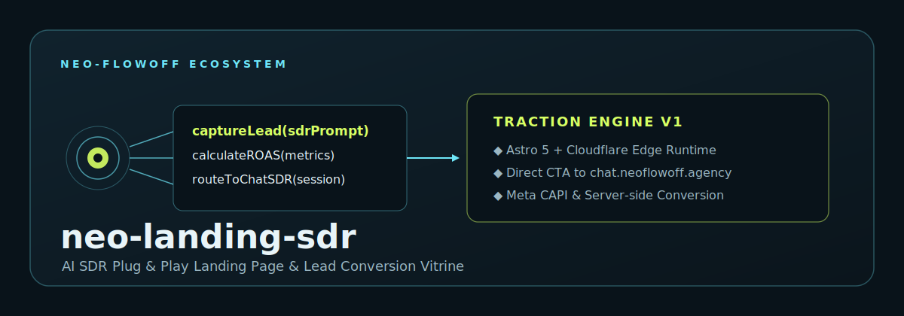

<!-- markdownlint-disable MD003 MD007 MD013 MD022 MD023 MD025 MD029 MD032 MD033 MD034 -->
# STANDARD MARKDOWN STYLE

```text
========================================
     NEO-FlowOFF · SVG BANNER RULES
========================================
Status: ACTIVE
Version: v1.0.0
========================================
```

## ⟠ Objetivo

Definir a especificação visual canônica do banner SVG vetorial para o repositório `neo-landing-sdr`, assegurando coerência com a identidade institucional **NEO-FlowOFF Ecosystem · neoflowoff.agency**.

────────────────────────────────────────

## ◈ Especificações Técnicas

* **Arquivo de Saída:** `docs/assets/neo-landing-sdr-banner.svg`
* **Dimensões e ViewBox:** `viewBox="0 0 1200 420" width="1200" height="420"`
* **Inserção no README:**

  ```markdown
  
  ```

────────────────────────────────────────

## ❖ Paleta Visual e Elementos

* **Fundo Externo:** `#09131A`
* **Cartão Principal:** Gradiente linear de `#10222D` para `#0B151C` com cantos arredondados (`rx=24`).
* **Cores de Contraste:**
  * Ciano: `#6EE7F9` (linhas de conexão, bordas e etiqueta superior).
  * Lima / Accent: `#D7FF64` (núcleo concêntrico, título de destaque, chamadas principais).
* **Tipografia:** Família monoespaçada (`ui-monospace, SFMono-Regular, Menlo, Monaco, Consolas, monospace`).

────────────────────────────────────────

## ⬡ Topologia Cartesiana do Banner

1. **Símbolo Concêntrico (Esquerda):** Representa o ponto de entrada da operação de tração.
2. **Primeiro Cartão (Funções Principais):**
   * `captureLead(poiSignal)`
   * `qualifyIntent(context)`
   * `routeToChat(NEØ_one)`
3. **Segundo Cartão (Conceitos do Domínio):**
   * Título: `AGENT SDR IA · ACTIVE`
   * `◆ Astro 5 + Cloudflare Edge Runtime`
   * `◆ Direct CTA to chat.neoflowoff.agency`
   * `◆ Meta CAPI & Server-side Conversion`
4. **Rodapé / Identidade:**
   * Título em destaque: `neo-landing-sdr`
   * Subtítulo: `Operação SDR IA Plug & Play · Superfície de Atendimento e Tração`
